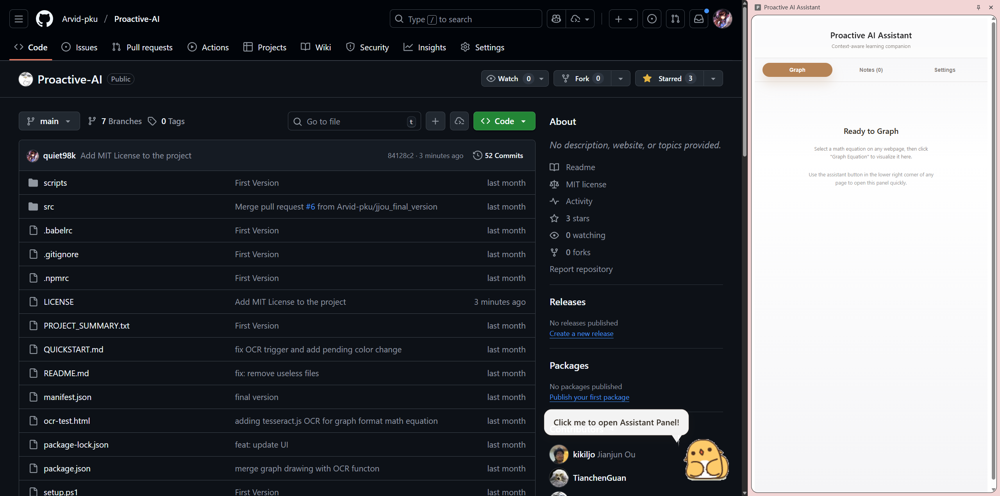

# Proactive AI Assistant

Proactive AI Assistant is a Chrome extension that watches what you hover or select on the web and surfaces the most helpful AI tools in-place. It can explain code, summarize articles, graph equations, extract tables, run OCR on images, and more—all without leaving the page.

## Demo


## Quick Start

1. **Install dependencies**
   ```bash
   npm install
   ```
2. **Build the extension**
   ```bash
   npm run build
   ```
3. **Load in Chrome**
   - Open `chrome://extensions`
   - Toggle on Developer mode
   - Click “Load unpacked” and select the `dist` folder
4. **Add your OpenAI API key**
   - Open the extension popup
   - Switch to the *Settings* tab
   - Save your key (stored locally via `chrome.storage`)

## Usage

- Hover over content or highlight text; the floating assistant suggests relevant actions.
- Results appear in the on-page window, while graphs and saved notes also sync to the side panel.
- The background service worker calls OpenAI directly from the browser, so keep your API key private.

## Development

- Run `npm run dev` for webpack watch mode during UI or script changes.
- Refresh the extension from `chrome://extensions` after each build.
- Logs worth checking:
  - `chrome://extensions` → “service worker” link for background events
  - Browser DevTools console for content script output

## Project Layout

```
src/
  background/    // API calls, tool execution, state storage
  content/       // DOM listeners, UI injection helpers
  ui/            // React floating assistant
  sidepanel/     // React side panel tabs
  popup/         // Extension popup UI
  utils/         // Content detectors, OCR helpers, tool metadata
manifest.json    // Chrome extension manifest
webpack.config.js
```

## Notes

- No backend: everything runs inside Chrome.
- Graphs, notes, and user settings persist via `chrome.storage.local`.
- New tools can be added by updating `src/utils/toolDefinitions.js` and wiring handlers in `src/background/index.js`.
